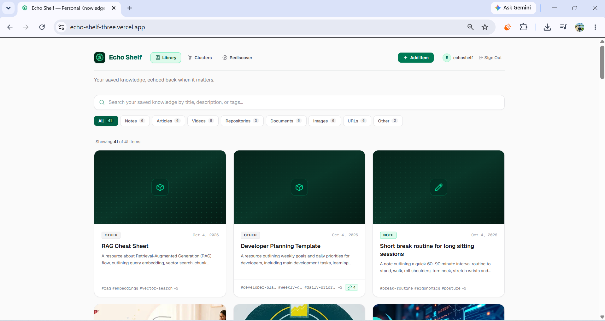
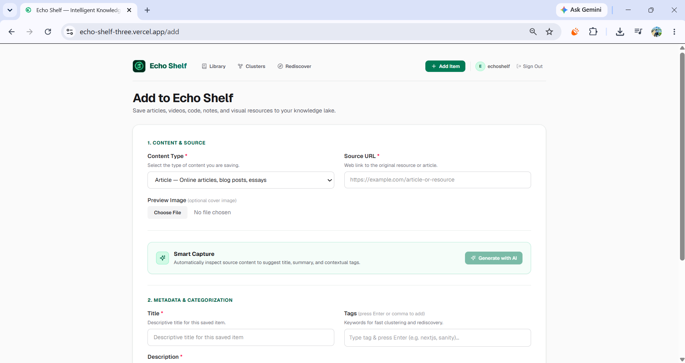
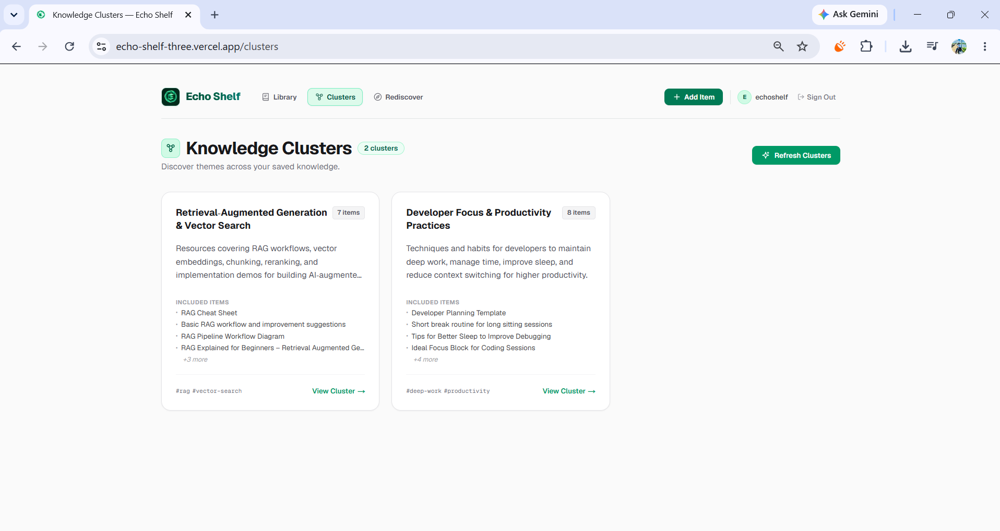
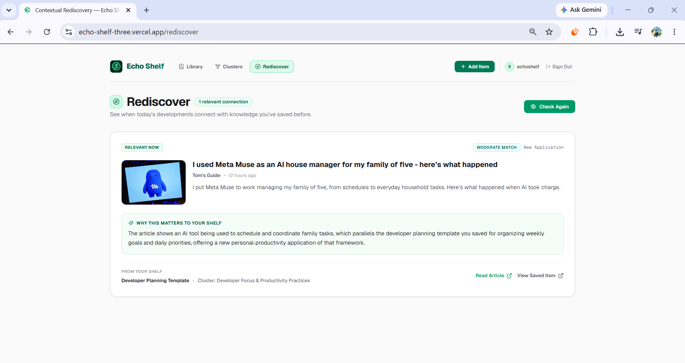
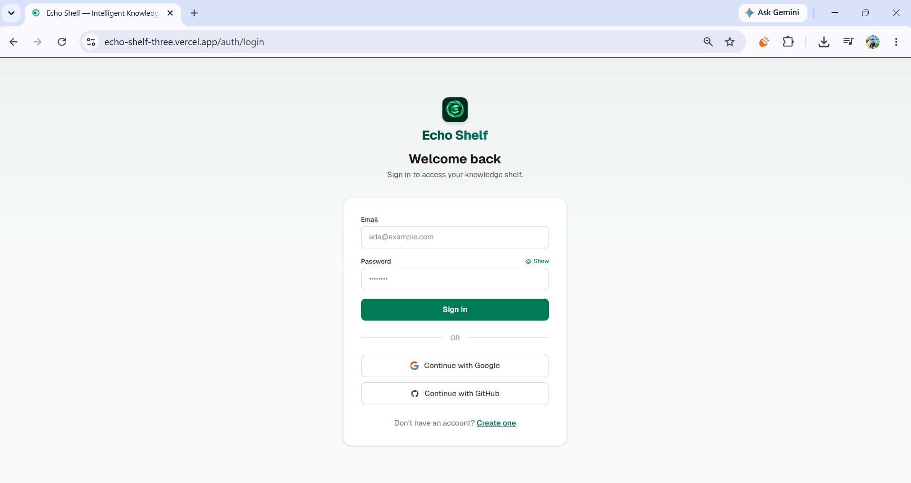

<p align="center">
  
</p>

<h1 align="center">Echo Shelf</h1>

<p align="center">
  <strong>Your saved knowledge, echoed back when it matters.</strong>
</p>

---

## Live Demo

- **Live Application**: [https://echo-shelf-three.vercel.app/](https://echo-shelf-three.vercel.app/)
- **Source Code**: [https://github.com/sheda3838/echo-shelf](https://github.com/sheda3838/echo-shelf)

### Demo Account

A pre-populated demonstration account is available for challenge testing and evaluation:

- **Email**: `echoshelf@gmail.com`
- **Password**: `password`

> **Note**: This account is pre-populated with realistic demonstration knowledge across multiple domains (DevOps & containers, web development, AI & RAG, ergonomics & workplace wellness, deep work & productivity) to enable full exploration of Smart Connections, Knowledge Clusters, and Contextual Rediscovery out of the box.

#### Recommended Testing Walkthrough:
1. **Sign in** using the demo credentials above at [`/auth/login`](https://echo-shelf-three.vercel.app/auth/login).
2. **Browse the mixed-content Library** to explore articles, YouTube videos, GitHub repositories, PDFs, notes, and diagrams with full-text search and tag filtering.
3. **Open saved items** and inspect **Smart Connections** with typed relationship reasoning, strength ratings, and connection explanations.
4. **Open Knowledge Clusters** ([`/clusters`](https://echo-shelf-three.vercel.app/clusters)) to inspect AI-generated emergent themes.
5. **Open Rediscover** ([`/rediscover`](https://echo-shelf-three.vercel.app/rediscover)) to inspect current live news matched against saved knowledge.
6. **Use Add Item** ([`/add`](https://echo-shelf-three.vercel.app/add)) if you want to test **Smart Capture** with any URL, video, repository, document, screenshot, or note.

---

## What is Echo Shelf?

**Echo Shelf** is an intelligent personal knowledge lake and second-brain system. Instead of acting as a passive bookmarking graveyard where saved content is quickly forgotten, Echo Shelf captures articles, notes, code repositories, videos, documents, and images—then actively connects them, groups them into conceptual themes, and surfaces them when relevant developments happen in the world.

Built on the **Sanity Content Lake**, Echo Shelf combines structured content modeling, automated multi-source content extraction, hosted AI reasoning via **Groq**, and live news retrieval for contextual rediscovery into a cohesive knowledge workspace.

---

## Core Idea

```
Capture → Connect → Resurface
```

1. **Capture**: Frictionless ingestion across 8 content types with deep metadata extraction and automated AI enrichment.
2. **Connect**: Structural and semantic graph relationships computed between saved items, with explicit relationship types, strength ratings, and plain-English explanations.
3. **Resurface**: User-triggered thematic clustering and contextual rediscovery linking historical saved knowledge to current real-world news and developments.

---

## Features

- **Personal Knowledge Lake**: Unified library with standardized 16:9 visual preview cards, content-type badges, full-text and tag filtering, and instant search.
- **Smart Capture**: One-click extraction from URLs, GitHub/GitLab repositories, YouTube videos, PDFs, Word documents, PowerPoint decks, Excel spreadsheets, images, and notes.
- **AI Smart Enrichment**: Generates concise titles, contextual summaries, and normalized tags on capture.
- **Smart Connections**: Discovers non-obvious conceptual links between disparate pieces of knowledge in your shelf.
- **Knowledge Clusters**: Self-organizing thematic clusters that reveal emergent topics across your saved items.
- **Contextual Rediscovery**: Fetches current news when triggered by the user to identify when new developments resonate with knowledge already saved on your shelf.
- **Exact Duplicate Detection**: URL canonicalization and source content fingerprinting prevent accidental duplicate entries while allowing intentional re-saves.
- **Multi-Provider Authentication**: Email/password, Google OAuth, and GitHub OAuth with secure server-side session handling.
- **Complete User Ownership & Isolation**: Strict per-user isolation enforced across all Sanity GROQ queries, mutations, AI operations, clusters, and rediscovery results.
- **Embedded Sanity Studio**: Direct access to raw structured content and schemas via `/studio` within the Next.js application.

---

## Smart Capture

Smart Capture handles diverse input sources and extracts meaningful text and metadata before passing it to AI for automated enrichment:

- **Web Articles & URLs**: Fetches and parses web content using `@mozilla/readability` and `jsdom` to isolate article body text from boilerplate navigation and ads.
- **Code Repositories**: Connects to the GitHub REST API and GitLab API to extract repository names, descriptions, primary languages, star counts, topics, and `README.md` documentation.
- **YouTube Videos**: Leverages the YouTube Data API v3 (with oEmbed fallback) to extract metadata such as title, description, channel, tags, publish date, duration, and thumbnail (transcript extraction is not part of the current MVP).
- **Documents**: Server-side binary parsing supporting:
  - PDF documents via `pdf-parse`
  - Microsoft Word (`.docx`) files via `mammoth`
  - PowerPoint (`.pptx`) presentations via `pptx-text-parser`
  - Excel (`.xlsx`) spreadsheets via `xlsx` (SheetJS)
- **Images**: Analyzes screenshots, diagrams, and photos using **Groq Vision** (`qwen/qwen3.8-27b`) to understand visual structure, diagrams, and embedded text.
- **Personal Notes**: Direct markdown text input for quick thoughts, meeting notes, or copied excerpts.

---

## Smart Connections

Echo Shelf does not rely solely on simple keyword overlap. Smart Connections operates in two distinct phases:

1. **Phase 1 (Metadata Candidate Shortlisting)**: Analyzes content types, shared tags, title keywords, and description terms against the user's existing Sanity library to construct a relevant candidate shortlist.
2. **Phase 2 (Deep Semantic Relationship Analysis)**: Dispatches candidate pairs to **Groq** (`openai/gpt-oss-120b`) to evaluate conceptual relationships.

The AI identifies specific relationship types:
- `prerequisite` (Foundational concept)
- `extends` (Builds on this)
- `complementary` (Complements this)
- `conceptual-overlap` (Shares core concepts)
- `practical-application` (Practical application)
- `contrast` (Different perspective)
- `alternative-approach` (Alternative approach)
- `implementation-detail` (Implementation detail)

Each connection is assigned a strength rating (`strong`, `moderate`, `weak`) and a tailored explanation of *why* the items are connected. Connections are persisted directly as reference arrays within Sanity document models.

---

## Knowledge Clusters

Knowledge Clusters analyze the user's saved knowledge lake to detect emerging conceptual themes. Generation and refresh are explicitly user-triggered.

- **Lightweight Clustering Flow**: When triggered by the user, gathers lightweight item metadata (IDs, titles, summaries, content types, and tags) and prompts Groq (`openai/gpt-oss-120b`) to discover natural groupings without leaking sensitive body text.
- **Sanity Persistence**: Clusters are saved as first-class `knowledgeCluster` documents containing titles, slugs, summaries, thematic tags, and references to constituent `savedItem` records.
- **Focused Exploration**: Dedicated cluster views (`/clusters/[id]`) allow users to explore all items belonging to a theme, opening items in separate tabs for seamless research.

---

## Contextual Rediscovery

Contextual Rediscovery solves the "saved and forgotten" problem by bridging past learning with present events. Current news is fetched when the user triggers "Check What's Relevant Now" / refresh:

1. Extracts key topic themes from the user's active Knowledge Clusters.
2. Queries the **GNews API** for current news articles matching those themes.
3. Submits live candidate headlines and descriptions to Groq (`openai/gpt-oss-120b`) to evaluate whether any current news article meaningfully connects with a saved item or cluster.
4. Generates an actionable card explaining **"Why this matters to your shelf"**, matching relevance (`strong` or `moderate`), and providing direct links to both the live news article and the related saved knowledge.
5. Persists the discovery as `rediscoveryResult` documents in Sanity.

---

## Exact Duplicate Detection

To prevent accidental re-saving while keeping the library clean:

- **Canonical URL Matching**: Normalizes URL protocols, `www` prefixes, trailing slashes, and strips tracking parameters (`utm_*`, `ref`, `fbclid`).
- **Content Fingerprinting**: Generates SHA-256 hashes of note text and uploaded document binary files.
- **Pre-Save Warning**: Displays an in-app alert when an item with identical canonical source or fingerprint already exists, displaying a snippet of the existing entry and offering a direct link to view it or an explicit "Save Anyway" override.

---

## Authentication & User Isolation

Echo Shelf implements server-enforced per-user data isolation:

- **Authentication Providers**: Supports Email/Password, Google OAuth, and GitHub OAuth powered by **Supabase Auth**.
- **SSR Cookie Sessions**: Utilizes `@supabase/ssr` with secure cookie management across server components, Server Actions, and Next.js middleware.
- **Sanity User Projection**: Authenticated Supabase users are mapped to a `user` document in Sanity via a deterministic opaque document ID derived server-side from the authenticated Supabase user ID. Supabase remains the source of truth for email and authentication.
- **Strict Data Isolation**: All Sanity queries filter strictly by ownership (`owner._ref == $ownerId`). Every Server Action verifies the authenticated user session before performing mutations, ensuring users can never query, modify, connect, cluster, or rediscover another user's content.

---

## How Sanity Is Used

Sanity is not used as a generic database—it serves as Echo Shelf's **structured Content Lake**:

- **Custom Content Architecture**: Schemas define rich relational types including document references, structured source objects, asset references, and nested relationship metadata.
- **Complex GROQ Querying**: Expressive GROQ queries power library sorting, keyword search, tag filtering, candidate shortlisting, cluster member expansion, and ownership isolation.
- **Embedded Sanity Studio**: Sanity Studio v5 is embedded directly at `/studio`, giving administrators and developers direct inspection into raw documents, schema definitions, and content revisions.
- **Custom Application Interface**: The user-facing Echo Shelf app is a fully custom Next.js 16 web application that reads from and writes to the Sanity Content Lake via `@sanity/client`.

---

## Sanity Data Model

The schema architecture comprises four primary document types:

### 1. `savedItem`
The central knowledge asset in Echo Shelf:
- `title` (string): Title of the saved item.
- `description` (text): Contextual summary or description.
- `contentType` (string): Enum (`article`, `note`, `video`, `repo`, `document`, `url`, `image`, `other`).
- `source` (object): Union containing `url`, `text` (for notes), or `file` (Sanity file asset).
- `image` (image): Sanity image asset for visual cover or uploaded image.
- `tags` (array of strings): Categorization and conceptual tags.
- `savedAt` (datetime): Timestamp when captured.
- `isFavorite` (boolean): Flag for pinned/favorite items.
- `connections` (array): References to other `savedItem` documents, with `strength`, `relationshipType`, and `explanation`.
- `sourceFingerprint` (string): Canonical URL or SHA-256 hash for duplicate detection.
- `owner` (reference): Mandatory reference to the owning `user` document.

### 2. `knowledgeCluster`
Thematic groupings of knowledge:
- `title` (string): Theme name.
- `slug` (slug): URL-friendly slug.
- `summary` (text): Overview of the conceptual theme.
- `tags` (array of strings): Topic keywords.
- `generatedAt` (datetime): Timestamp of cluster generation.
- `items` (array of references): Member `savedItem` documents.
- `owner` (reference): Reference to the owning `user`.

### 3. `rediscoveryResult`
Connections between live news and saved knowledge:
- `articleTitle` (string): News headline.
- `articleDescription` (text): News snippet.
- `articleUrl` (url): URL to the original article.
- `articleImageUrl` (url): Optional thumbnail.
- `articleSource` (string): Publisher or news outlet name.
- `publishedAt` (datetime): Publication timestamp.
- `relevance` (string): `strong` or `moderate`.
- `connectionType` (string): Nature of the conceptual link.
- `reason` (text): Explanation of why this news matters to the user's shelf.
- `discoveredAt` (datetime): Timestamp when resurfaced.
- `savedItem` (reference): Link to the related `savedItem`.
- `cluster` (reference): Link to the related `knowledgeCluster`.
- `owner` (reference): Reference to the owning `user`.

### 4. `user`
Privacy-safe application identity projection (Supabase remains the sole source of truth for email and authentication; Sanity stores no email or raw Supabase user ID):
- `_id` (string): Deterministic opaque Sanity user document ID derived server-side from authenticated Supabase user ID (`user.<sha256>`).
- `displayName` (string): User display name.
- `avatarUrl` (url): Optional profile picture URL.
- `createdAt` (datetime): Account creation timestamp.

---

## AI & External Services

- **Groq (Hosted Inference Provider)**: Hosted high-throughput AI inference provider powering all application reasoning.
  - **Text & Reasoning Model (`openai/gpt-oss-120b`)**: Used for Smart Capture metadata generation, Smart Connections relationship analysis, Knowledge Clusters theme synthesis, and Contextual Rediscovery relevance matching.
  - **Vision Model (`qwen/qwen3.8-27b`)**: Used for visual inspection, diagram comprehension, and text extraction from uploaded images.
- **Supabase Auth**: Authentication service managing email credentials, session tokens, and Google / GitHub OAuth integrations.
- **YouTube Data API v3**: Fetches video metadata such as title, description, channel, tags, publish date, duration, and thumbnail (with automatic oEmbed fallback; transcript extraction is not part of the current MVP).
- **GNews API**: Fetches real-time, topic-targeted live news feeds for Contextual Rediscovery.
- **GitHub REST API & GitLab API**: Extracts repository descriptions, topics, star counts, and README documentation.
- **Document Extractors**: In-memory document parsers including `@mozilla/readability`, `jsdom`, `pdf-parse`, `mammoth`, `pptx-text-parser`, and `xlsx`.

---

## Tech Stack

- **Framework**: [Next.js 16](https://nextjs.org/) (App Router, Turbopack, React Server Actions)
- **UI Library**: [React 19](https://react.dev/)
- **Language**: [TypeScript 5](https://www.typescriptlang.org/)
- **Content Lake**: [Sanity v5](https://www.sanity.io/) (Content Lake, Embedded Sanity Studio, `@sanity/client`)
- **AI Inference**: [Groq Cloud SDK](https://groq.com/)
- **Authentication**: [Supabase Auth](https://supabase.com/) (`@supabase/ssr`, `@supabase/supabase-js`)
- **Styling**: [Tailwind CSS v4](https://tailwindcss.com/) with custom brand theme tokens
- **Typography**: Geist Sans & Geist Mono via `next/font`

---

## Local Setup

### Prerequisites
- Node.js 20.x or higher
- npm (or pnpm/yarn)
- A Sanity project (with API write token)
- A Groq Cloud API key
- A Supabase project (with email auth and optional OAuth enabled)

### Installation

1. Clone the repository:
   ```bash
   git clone https://github.com/sheda3838/echo-shelf.git
   cd echo-shelf
   ```

2. Install dependencies:
   ```bash
   npm install
   ```

3. Create your local environment configuration:
   ```bash
   cp .env.example .env.local
   # or manually create .env.local and add the required environment variables below
   ```

---

## Environment Variables

| Variable Name | Required | Description |
|---|---|---|
| `NEXT_PUBLIC_SANITY_PROJECT_ID` | **Yes** | Your Sanity Project ID |
| `NEXT_PUBLIC_SANITY_DATASET` | **Yes** | Sanity Dataset (e.g., `production`) |
| `SANITY_API_WRITE_TOKEN` | **Yes** | Server-side Sanity API token with write permissions |
| `GROQ_API_KEY` | **Yes** | Server-side Groq API key for hosted LLM inference |
| `NEXT_PUBLIC_SUPABASE_URL` | **Yes** | Your Supabase Project URL |
| `NEXT_PUBLIC_SUPABASE_PUBLISHABLE_KEY` | **Yes** | Your Supabase Project Publishable / Anon key |
| `NEXT_PUBLIC_SANITY_API_VERSION` | No | Sanity API version (defaults to `2026-09-27`) |
| `YOUTUBE_API_KEY` | **Yes** | Google/YouTube Data API v3 key for enhanced video extraction |
| `GNEWS_API_KEY` | **Yes** | GNews API key for live news search in Contextual Rediscovery |
| `GITHUB_TOKEN` | No | GitHub personal access token for higher repository API rate limits |
| `GITLAB_TOKEN` | No | GitLab access token for private or higher-rate repository queries |

---

## Running Locally

Start the local development server:

```bash
npm run dev
```

- **Application**: Open [http://localhost:3000](http://localhost:3000)
- **Sanity Studio**: Open [http://localhost:3000/studio](http://localhost:3000/studio)

---

## Tests

The project includes test scripts for verifying isolated features, duplicate detection, and auth boundary isolation:

```bash
# Verify authentication flows
npm run test:auth

# Verify per-user tenant data isolation
npm run test:isolation

# Verify canonical URL and source fingerprint duplicate detection
npm run test:duplicates

# Verify Smart Connections candidate shortlisting and AI analysis
npm run test:connections

# Verify Knowledge Clusters generation and Sanity persistence
npm run test:clusters

# Verify Contextual Rediscovery news matching and persistence
npm run test:rediscovery

# Static analysis and type safety
npx tsc --noEmit
npm run lint

# Production compilation test
npm run build
```

---

## Build Process

Echo Shelf was designed and built iteratively using an AI-native development workflow. Every technical decision, hypothesis, prototype, test, and architectural adjustment was recorded continuously in [BUILD_LOG.md](BUILD_LOG.md).

The build log documents:
- Initial project architecture and data modeling iterations.
- Real-world extraction challenges across diverse content formats.
- **The Image Capture Pivot**: An early OCR-only parser proved fragile when encountering diagrams, handwritten notes, and mixed media. The system was overhauled to use hosted vision models via Groq (`qwen/qwen3.8-27b`), dramatically improving accuracy.
- Two-stage connection filtering designed to balance LLM token costs with semantic relationship depth.
- Per-user data isolation testing and boundary validation.

For the full, unvarnished build narrative, refer to [BUILD_LOG.md](BUILD_LOG.md).

---

## Sanity Challenge

Echo Shelf was built for the **DEV Community Sanity Challenge**:
- **Track**: Path Two — *Vibe-Code Something Strange*
- **Sanity Project ID**: `jcon1mtg`
- **Dataset**: `production`

The project highlights the flexibility of the **Sanity Content Lake** as an intelligent personal knowledge lake rather than a traditional blog CMS:
- **Core Structured Content Lake Models**:
  - `savedItem`: Relational knowledge assets storing normalized titles, descriptions, multi-format source objects (URLs, text, uploaded file assets), image assets, tags, canonical fingerprints for duplicate prevention, and graph connection reference arrays.
  - `knowledgeCluster`: Dynamic thematic clusters storing titles, unique slugs, AI-synthesized summaries, topic tags, and reference arrays linking constituent `savedItem` records.
  - `rediscoveryResult`: Synthesized connections between live news headlines and saved shelf knowledge, storing article metadata, relevance levels, and references to both `savedItem` and `knowledgeCluster` documents.
  - `user`: Privacy-safe user identity projection derived deterministically server-side from authenticated Supabase user IDs (`user.<sha256>`), ensuring strict multi-tenant data isolation without storing raw emails or auth secrets in Sanity.
- **Deep GROQ Querying**: Expressive GROQ queries power candidate shortlisting, tag filtering, full-text searches, cluster item expansion, and tenant-isolated data retrieval.
- **Embedded Sanity Studio**: Full Sanity Studio v5 embedded directly at `/studio` within the Next.js application for transparent content inspection and schema management.
- **Custom Application Interface**: Fully custom Next.js 16 web application powered by `@sanity/client` and React Server Actions.

---

## Screenshots

### 1. Library & Personal Knowledge Lake
*Unified library with 16:9 media previews, content-type badges, full-text search, and tag filtering.*



### 2. Smart Capture & Ingestion
*Multi-source ingestion interface supporting URLs, repositories, YouTube videos, document uploads, vision-based image analysis, and notes.*



### 3. Knowledge Clusters
*Thematic knowledge clusters synthesized across saved items with member counts, topic tags, and relational summaries.*



### 4. Contextual Rediscovery
*Live news feeds matched against saved library themes to explain why breaking events matter to existing knowledge.*



### 5. Multi-Provider Authentication
*Emerald-themed authentication interface supporting email/password and OAuth with server-side cookie sessions.*



---

## Deployment

Echo Shelf is deployed to production on [Vercel](https://vercel.com/):
- **Live Production URL**: [https://echo-shelf-three.vercel.app/](https://echo-shelf-three.vercel.app/)

### Deploying Your Own Instance

1. Push your repository to GitHub:
   ```bash
   git clone https://github.com/sheda3838/echo-shelf.git
   ```
2. Import the project into Vercel.
3. Configure the **Required Environment Variables** in your Vercel project settings:
   - `NEXT_PUBLIC_SANITY_PROJECT_ID`
   - `NEXT_PUBLIC_SANITY_DATASET`
   - `SANITY_API_WRITE_TOKEN`
   - `GROQ_API_KEY`
   - `NEXT_PUBLIC_SUPABASE_URL`
   - `NEXT_PUBLIC_SUPABASE_PUBLISHABLE_KEY`
   - *(Optional)* `YOUTUBE_API_KEY`, `GNEWS_API_KEY`, `GITHUB_TOKEN`, `GITLAB_TOKEN`
4. Deploy.
5. In your Supabase Dashboard:
   - Update **Site URL** to your production Vercel domain (`https://echo-shelf-three.vercel.app` or your custom domain).
   - Add `https://echo-shelf-three.vercel.app/auth/callback` to **Redirect URLs**.
